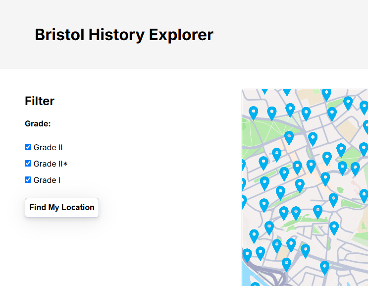
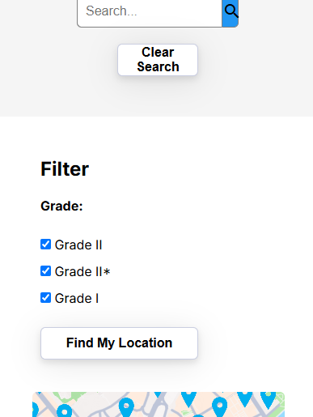

# Implementation

## Introduction
TODO: Describe the system implemented (Describe the dataset. Are there any known issues? Describe any configuration data).
Dataset

The system uses a historical sites dataset, which includes:

Site Name: The official name of the historical site.

Location Coordinates: Latitude and longitude for map rendering.

Grade: Grade of site

Link to external site: Some of the entries provide a link to an external site that gives more information

**Known Issues:**

Large number of entries will make the map very laggy if using markers

Have to use symbols, which is more complicated

## Project Structure
TODO: Provide an outline of the project folder structure and the role of each file within it.
provide a table listing the number of jslint warnings/reports for each module.

index.html -> Contains all the html code, map configuration functions and event listeners.

script.js -> Contains the other functions, such as search, filter, get location.

style.css -> contains the style.

## Software Architecture
TODO: Describe the major components of your architecture. Are any particular architectural styles being used?

**Major Components**

The application follows a Single-Page Application (SPA) architecture and consists of the following core components:

1. **User Interface (UI)**  
   - Developed using **HTML, CSS, and JavaScript** to create an interactive and visually engaging experience.  
   - Provides a dynamic interface for users to explore historical sites, including search and filtering functionalities.  

2. **Data Handling and Management**  
   - The application retrieves historical site data from the **‘Listed Buildings in Bristol’ dataset**.  
   - Data is fetched dynamically using the **Fetch API**.  

3. **Rendering Engine**  
   - JavaScript dynamically updates content based on user interactions.  
   - DOM manipulation techniques ensure efficient rendering of historical site details without reloading the page.  

4. **State Management**  
   - Application state, such as selected filters or search queries, is maintained using JavaScript variables.  
  
**Architectural Style**

The application follows the **Single-Page Application (SPA) architectural style**, characterized by:  
- A single initial HTML page that dynamically updates based on user interactions.  
- JavaScript-driven navigation and content updates instead of traditional full-page reloads.  
- Improved user experience by reducing server requests and enabling smooth transitions between views.  

This architecture ensures an efficient and responsive application while maintaining a lightweight implementation without a backend.

## Bristol Open Data API
TODO: Document each query to Bristol Open Data

TODO: Repeat as necessary

# User guide
TODO: Explain how each use-case works by providing step-by-step screenshots for each use-case. This should be based on a tested scenario.

## Step-by-Step Guide: Filtering by Grade on Bristol History Explorer - Ollie 

This guide explains how to filter historical sites by their listed building grade on the *Bristol History Explorer* website.

## Step 1: Open the Website
- Go to the *Bristol History Explorer* website in your browser.

## Step 2: Locate the Filter Menu
- Find the **Filter** button or panel, left side of page on desktop, above the map on mobile.
- You should see options for different grades (e.g., **Grade I, Grade II*, and Grade II**).

**Desktop**

**Mobile**

## Step 3: Choose the Desired Grade
- Click or tap on the grade you want to filter by (e.g., **Grade I** for the most historically significant buildings).
- You may also have the option to select multiple grades at once.

## Step 4: Explore the Results
- Browse the filtered list or map to see the historical sites that match your criteria.
- Click on any site for more details, such as its history, images, and location.

