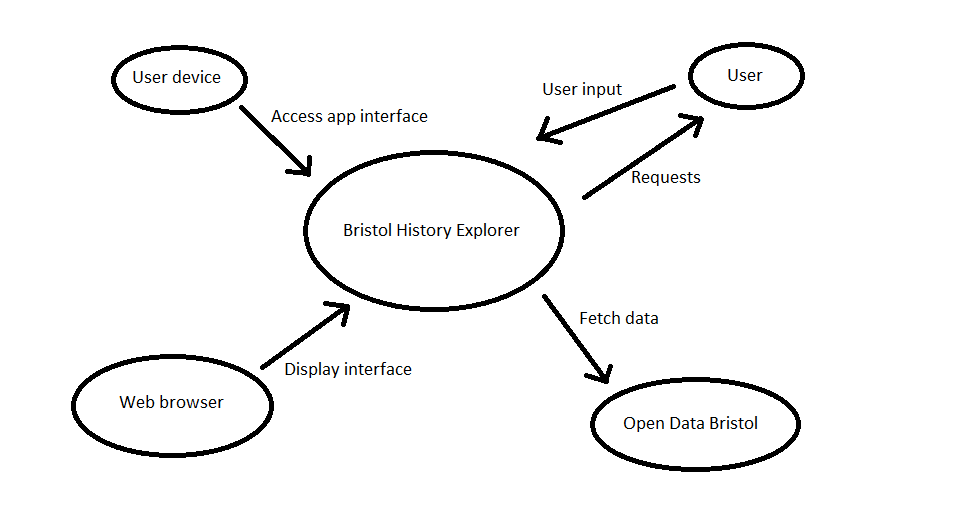

# Project Proposal
Website name: Bristol History Explorer
## Business Case

### Problem statement
Bristol boasts a wealth of listed buildings and historical landmarks, yet many remain overlooked due to a lack of centralized and interactive tools for discovery. Current resources are scattered, often providing only basic information or focusing on well-known sites. This project will create a web app that highlights Bristol's listed buildings, offering an engaging platform for users to learn about and explore the city's historical treasures.

### Business benefits
Improved Historical Awareness: The app will increase awareness of Bristol’s lesser-known historical sites, encouraging users to explore beyond popular tourist spots.  
    
Support for Local Tourism: The app will serve as a tool to promote local tourism, benefiting small businesses and local guides by attracting history enthusiasts.  
Educational Tool: The app can serve as a resource for students and educators, providing information on historical locations and encouraging interactive learning experiences.

### Options Considered
Existing Apps: Apps like Google Maps and general tourist apps provide information on popular sites put a lack a focus on historical context and interactive historical context.
Guidebooks & Websites: Static content fails to leverage interactive features like location-based discovery.

### Expected Risks
User Engagement: Potential difficulty in attracting a consistent user base if the value of exploring historical sites is not communicated effectively.
Data Quality and Coverage: The dataset from Bristol Open Data may have gaps, outdated information, or inaccuracies that could affect the user experience and site reliability.
Technical Integration: Challenges in integrating diverse data sources and ensuring the app runs smoothly on various devices and platforms

## Project Scope
Front-End Development:
- Build a responsive web interface for desktop and mobile using HTML, CSS, and JavaScript.
  
Interactive Map and Filters:
- Fetch and display data from the Bristol Open Data API to show site information.  
- Implement dataset integration to allow filtering and visualization of listed buildings.

