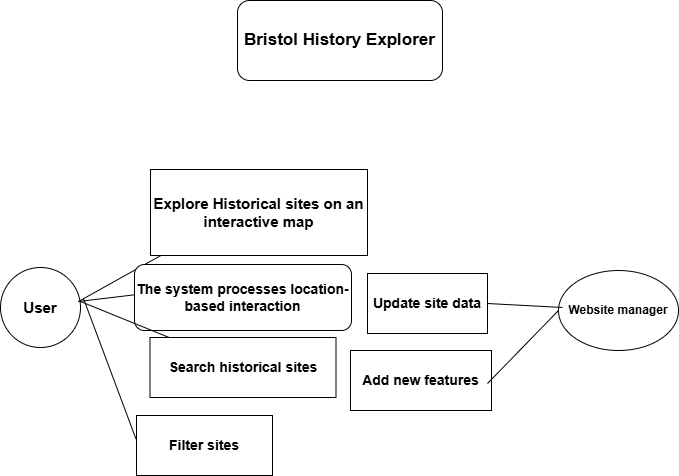

# Requirements

## User Needs

### User stories
As a tourist, I want to find historical sites near my current location so that I can easily explore Bristol’s heritage without extensive planning.

As a local resident, I want to discover lesser-known historical landmarks in Bristol so that I can learn more about my city’s history.

As a student, I want to search for historical sites by specific time periods or themes so that I can find relevant information for my school projects.

As a history enthusiast, I want to save a list of my favorite historical sites so that I can revisit them and share recommendations with friends.

As a parent, I want to find child-friendly historical sites or walking routes so that my family can enjoy educational outings together.

### Actors
Tourists: Visitors to Bristol who want to explore the city’s historical sites.

Local Residents: People living in Bristol who are interested in discovering more about their city's history.

Students: Individuals using the app as a resource for educational purposes.

History Enthusiasts: Users with a strong interest in exploring historical locations and learning about the past.

Parents: Families seeking educational and enjoyable activities for their children.

### Use Cases

|  UC2| Virtual Tour with Augmented Reality (AR)Virtual | 
| -------------------------------------- | ------------------- |
| **Description** | Users can take a virtual tour of historical sites using AR, overlaying information on their smartphone camera view for an immersive experience. This enhances learning and engagement. |
| **Actors** |Tourists, Local Residents, History Enthusiasts, Students |
| **Assumptions** | Users have a smartphone with AR capabilities and an active internet connection.|
| **Steps** |1. User launches the AR feature within the app.
2. The app detects the user's location and identifies nearby historical sites.
3. User points their smartphone camera at a site, and the app overlays historical facts, images, and animations.
4. User can interact with the AR content (e.g., tap to hear an audio guide). |
| **Variations** | If the user is not on-site, the app can simulate the AR experience using preloaded images and data |
| **Non-functional** |The AR content should load within 3 seconds and be visually stable without excessive lag |
| **Issues** | TEnsuring AR content is accurate and aligns correctly with real-world locations.|

| UC1 | Filter sites by grade - **OLLIE** | 
| -------------------------------------- | ------------------- |
| **Description** | Users can explore historical sites through an interactive map, viewing site details by clicking on map markers. They can then filter buildings by grade to narrow down which historical sites they are most interested in seeing |
| **Actors** | Tourists, Local Residents, History Enthusiasts, Students |
| **Assumptions** | Users have an internet connection to load the map and fetch site data.</td></tr>
| **Steps** | 1. The app loads a map of Bristol, highlighting historical sites with markers. 2. User uses the checkboxes to pick which grade(s) of buildings they would like to see. 3. User then finds the site they are interested in 4. User clicks on a marker to view the site’s details, including name, description, grade, and external information. |
| **Variations** | User can search for a site then filter to find the exact match |
| **Non-functional** | The map should load within 4 seconds and remain responsive during navigation. |
| **Issues** | Managing performance issues when displaying a large number of site markers. |

TODO: Your Use-Case diagram should include all use-cases.

## Software Requirements Specification
### Functional requirements

| **Requirement ID** | **Requirement**                                                                                  | **Use Case ID**|
|---------------------|-------------------------------------------------------------------------------------------------|----------------|
| 1                   | The system shall display an interactive map with markers for historical sites.                  | UC4            |
| 2                   | The system shall allow users to filter historical sites by categories such as grade| UC2, UC4     |
| 3                   | The system shall enable users to view detailed information about a selected historical site.    | UC4            |

### Non-Functional Requirements

| **Requirement ID** | **Requirement**                                                                                 | **Use Case ID** |
|---------------------|------------------------------------------------------------------------------------------------|-----------------|
| 1                   | The system shall load the interactive map within 4 seconds to ensure smooth user experience.   | UC4             |
| 2                   | The system shall handle a minimum of 500 simultaneous users without performance degradation.   | All UCs         |
| 3                   | The system shall have a responsive design, optimized for both desktop and mobile devices.      | All UCs         |
